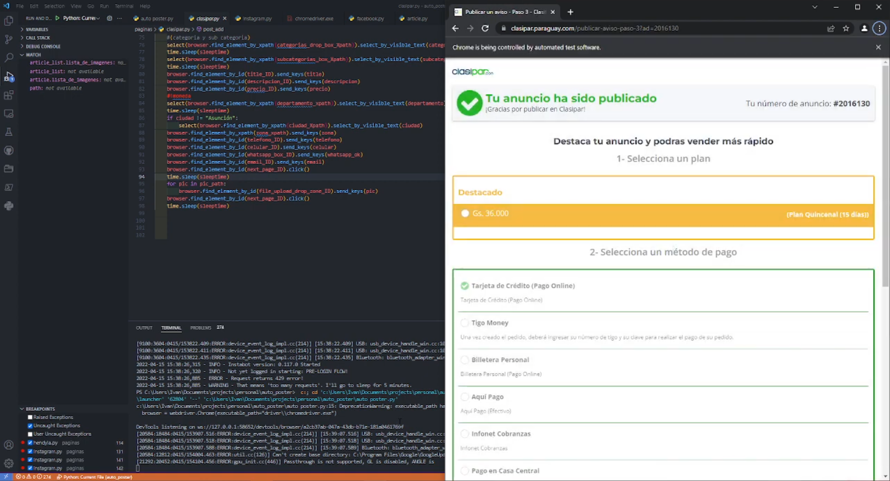
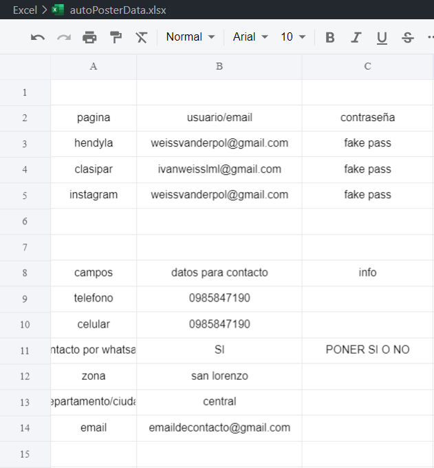
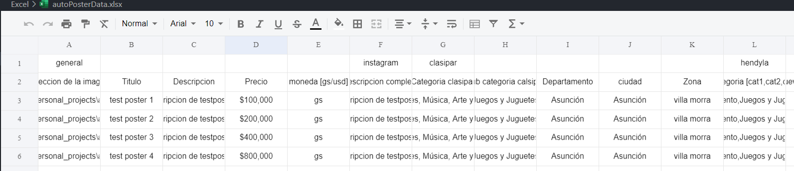
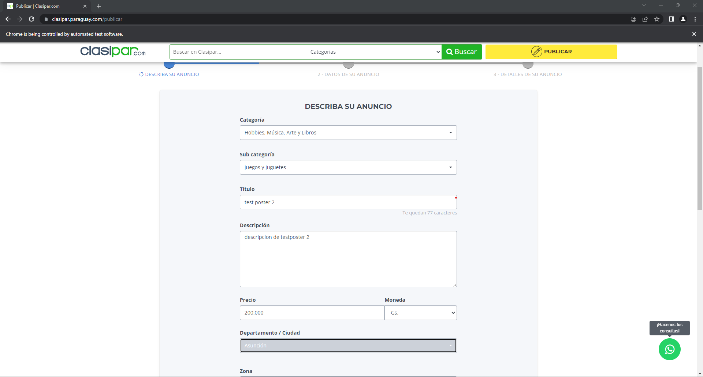
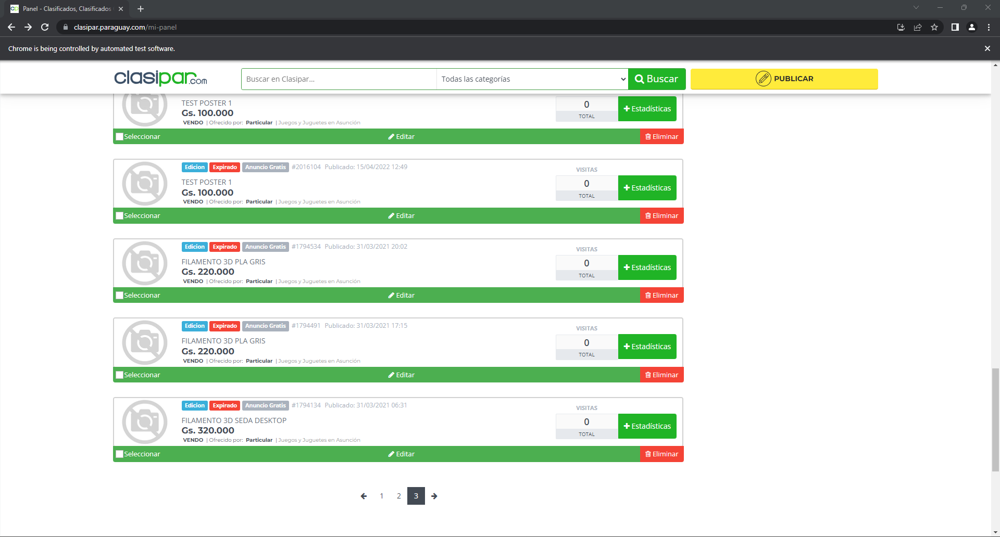

automatic Add poster

##### problem

in my 3d printing business i had to post multiple adds for all my products online
doing this manually would take a lot of time, and i could  do manual mistakes

##### solution

find a way to atumatically post the adds with a program

##### idea

i can store all my data in a file (in this case i chose excel to take advantage of the grid properties and structure )
with python i can read the file , store the info in a add_object and make an list of add_objects
now with the list of objects i can load the information to the web with selenium

#### DEMO
i made a demo (in spanish) of me running the program (note 0 profesional video but gets the job done )

##### requierments 

* download the latest chrome browser => https://chromedriver.chromium.org/downloads
* download the project from my github => [github_link](https://github.com/IvanWeissVanDerPolGH/automated-posting)
* download the requierments for the project

### step 1 setup your own credentials for tha pages in the excel

### step 2 add your products in the products tab 

### step 3 run auto poster.py 

### step 4? it runs  and you can watch as it is posting the adds

### in total i posted 3 pages of adds for my actual business 

