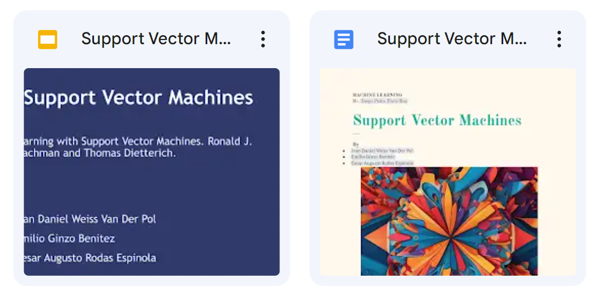

automatic Add poster

##### problem

one of my asingments at FP-UNA was to make a presentation about support vector machines
for this a prepared a quick intro book a slide presentation and a bit of code to show the algorithm in practive

idea

make a capsulated solution to generate the scenario needed to train the models
train the models and display the results

DEMO

you can check out the files in my google drive

[LINK](https://github.com/IvanWeissVanDerPolGH/Machine-learning)

