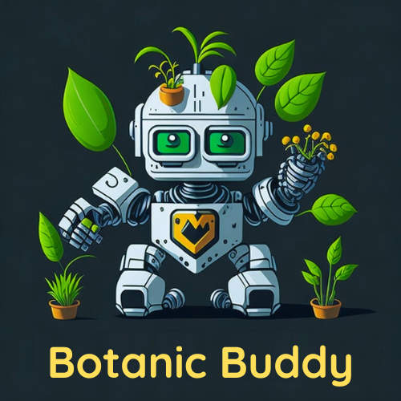

Hello, I'm Ivan Weiss, a 23-year-old software developer passionate about crafting innovative solutions. With a strong academic background in Software Engineering, I bring a diverse set of skills and expertise to the table

## Where i've studied

### BACHELOR'S DEGREE IN COMPUTER SCIENCE AT FP-UNA<a href="https://www.pol.una.py//" rel="some text">{:height="50px" width="50px" .callout}</a> 

 I'm pursuing my passion for technology by earning a Bachelor's degree in Computer Science. During my studies, I gained a solid foundation in computer programming, algorithms, data structures, and software development. The program equipped me with the necessary skills to analyze complex problems, design efficient solutions, and develop robust software applications. I had the opportunity to work on various projects, collaborate with classmates, and learn from experienced professors.
### STUDY ABROAD PROGRAM IN WICHITA, KANSAS <a href="https://www.wichita.edu/" rel="some text">{:height="100px" width="100px" .callout}</a>

 i had the oportunity to study in the USA with a scholarship offered by BECAL. douring my stay in the Wichita State University i practiced my english to perfection. in the usa i participated in many events and even got to the second phase of a business competition with my idea for an automated reforestation rover 

 youtube presentation ->
<a href="https://youtu.be/J051XxNL2iM" rel="some text">{:height="50px" width="50px" .callout}</a>
